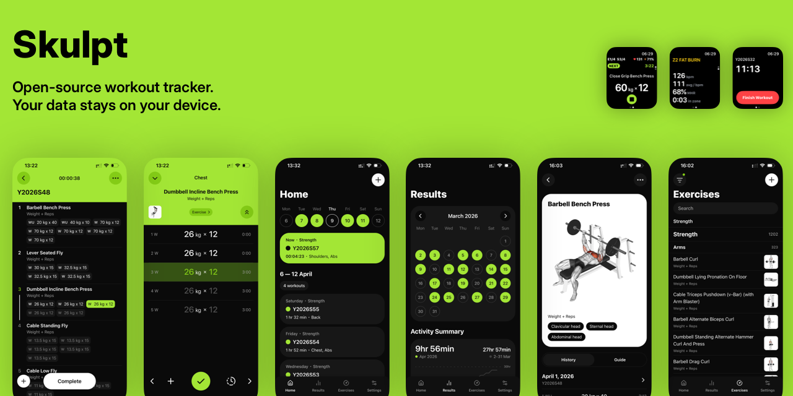

<p align="center">
  <picture>
    
  </picture>
</p>

<p align="center">
  <a href="https://apps.apple.com/us/app/skulpt-gym-workout-tracker/id6749158262">
    
  </a>
  &nbsp;
  
  &nbsp;
  
  &nbsp;
  
</p>

<p align="center">
  <strong>Free · Open Source · Local-First · No Subscriptions</strong><br/>
  Your workout data lives on your device. Sync is optional and fully self-hostable.
</p>

---

A full-featured workout tracker for iOS and Android built with React Native / Expo. All data lives on-device in a local SQLite database — the app works fully offline with zero backend dependency. Sync is an optional layer on top: connect to the hosted Skulpt server, run your own self-hosted sync backend, or skip sync entirely and stay completely local.

---

## Why Skulpt?

| | Skulpt | Strong | Hevy |
|---|:---:|:---:|:---:|
| Free forever | ✅ | ❌ Freemium | ❌ Freemium |
| Open source | ✅ GPL-3.0 | ❌ | ❌ |
| Local-first (data on device) | ✅ | ❌ | ❌ |
| Self-hosted sync | ✅ | ❌ | ❌ |
| Works fully offline | ✅ | ❌ | ❌ |
| Health data never uploaded | ✅ | ❌ | ❌ |
| Apple Watch app | ✅ | ✅ | ❌ |
| Live Activity / Dynamic Island | ✅ | ✅ | ❌ |

---

## Try it

**[Download on the App Store](https://apps.apple.com/us/app/skulpt-gym-workout-tracker/id6749158262)** — free, no subscriptions.

The App Store build comes with Skulpt cloud sync enabled. Only workout data is synced — workouts, exercises, sets, and measurements — i.e. the data you can't recover if you reinstall or switch devices. Health data (from Apple Health or Google Health Connect) is **never** uploaded anywhere and stays entirely on your device.

If you need a build with sync completely disabled, follow the [Getting Started](#getting-started) guide below to build your own binary with `EXPO_PUBLIC_SYNC_HOST` unset.

---

## Features

- **Workout planner & tracker** — create workouts from a library of exercises, log sets as you go, and review completed sessions
- **Flexible set types** — working, warm-up, drop set, failure; track weight, reps, time, and/or distance per exercise
- **Supersets / circuits** — group exercises into single, superset, triset, or circuit blocks
- **Body measurements** — log and chart any metric with automatic import from Apple Health / Google Health Connect
- **Rest timer** — configurable rest periods with haptic and audio cues
- **Apple Watch app** — full workout control from your wrist with heart-rate zones
- **Live Activity & Dynamic Island** — real-time workout status on the lock screen and Dynamic Island (iOS 16.1+)
- **Local-first** — all data lives in an on-device SQLite database; the app is fully functional with no network at all
- **Optional sync** — connect to the Skulpt cloud, self-host your own sync server, or run without any sync
- **Heart-rate zones** — configurable max-HR formula (Nes, Fox, Tanaka, Inbar, Gulati, Gellish, or manual)
- **Localisation** — English, Spanish, Hindi, Russian, Chinese
- **Theming** — light / dark / system with full Unistyles theming
- **Customisable units** — kg / lb, km / mi, cm / in, Celsius / Fahrenheit

---

## Self-Hosting

Skulpt's sync protocol is intentionally minimal. Your server needs to implement exactly two endpoints — a batch push and an incremental pull — and the client handles everything else.

### Protocol

**Push** — the client sends a single batch request with all pending mutations:

```
POST /sync/push
Authorization: Bearer <token>
x-skulpt-sync-schema: 2

{
  "<table>": {
    "created": [ { ...record } ],
    "updated": [ { ...record } ],
    "deleted": [ "<id>", ... ]
  },
  ...
}
```

**Pull** — the client requests all changes since its last sync timestamp:

```
GET /sync/pull?since=<lastSyncTimestamp>
Authorization: Bearer <token>
x-skulpt-sync-schema: 2

→ {
    "<table>": {
      "records":    [ { ...record } ],
      "deletedIds": [ "<id>", ... ],
      "timestamp":  1234567890
    },
    ...
  }
```

The client uses last-write-wins conflict resolution keyed on `updatedAt`. On a `409 missing_record` response to a push, the client automatically pulls the latest state and retries.

### Connecting the app

```env
EXPO_PUBLIC_SYNC_HOST=https://your-server.example.com
```

All workout data syncs through your own infrastructure. Health data never leaves the device regardless of sync configuration.

> **No server? No problem.** Omit `EXPO_PUBLIC_SYNC_HOST` entirely and the app runs in fully local-only mode — no network calls, no registration, nothing.

---

## Roadmap

### ① Stable workout core
Polish and harden the end-to-end workout experience — from planning through logging to history review. This is the foundation everything else builds on.

### ② Whoop-level health intelligence
Deep tracking of recovery, readiness, and training load on par with dedicated wearables. Metrics are sourced from Apple Health (iOS) and Google Health Connect (Android), which aggregate data from any connected device — Apple Watch, Garmin, Whoop, Oura, Polar, and others — so Skulpt works with whatever hardware the user already owns.

### ③ AI-ready tool layer
A set of composable, privacy-first tools designed for AI agents: each tool computes a specific metric or insight (volume load, recovery score, HRV trend, strain index, etc.) and returns the result without ever exposing the underlying raw data to an external system. Source data flows from the user's wearables into Apple Health / Google Health Connect, and only derived, aggregated values leave the device.

### ④ Agentic protocol
An open, vendor-neutral protocol for connecting AI agents to Skulpt. Any agent — regardless of the underlying model or platform — can be plugged in, query the tool layer, reason over computed metrics, and surface personalised recommendations. The protocol is deliberately model-agnostic: it defines a contract, not an implementation, so it works equally well with a local on-device model, a self-hosted LLM, or any cloud AI service.

### ⑤ First-class agent UI
A native interface for managing and interacting with connected agents directly inside the app — configure which agents have access, inspect what they see, and have natural conversations grounded in your actual training data, all without leaving Skulpt.

---

## Architecture

### Local-First Data Layer

Every piece of data — workouts, exercises, sets, measurements, user settings — is stored in an on-device SQLite database managed by [Drizzle ORM](https://orm.drizzle.team/). The app boots instantly, works fully offline, and never requires a server connection.

```
┌─────────────────────────────────┐
│         React Native App        │
│                                 │
│  ┌──────────────────────────┐   │
│  │   Drizzle ORM + SQLite   │   │
│  │   (on-device, always)    │   │
│  └──────────┬───────────────┘   │
│             │ mutations         │
│  ┌──────────▼───────────────┐   │
│  │       sync_queue         │   │
│  └──────────┬───────────────┘   │
└────────────-│-------------------┘
             │ (optional)
    ┌────────▼─────────┐
    │   Sync Engine    │
    │   src/sync/      │
    │                  │
    │  push: compact   │
    │  + batch send    │
    │                  │
    │  pull: incremental│
    │  + LWW upsert    │
    └────────┬─────────┘
             │
    ┌────────▼──────────────────┐
    │  Your server (two routes) │
    │  POST /sync/push          │
    │  GET  /sync/pull          │
    └───────────────────────────┘
```

### Sync Engine

A `sync_queue` table records every local mutation (create / update / delete) as it happens. The sync cycle:

1. **Push** — pending operations are compacted per record (multiple updates to the same row collapse into one) and sent to the server in a single batch request.
2. **Pull** — the server returns all records changed since the stored `lastSyncTimestamp`; incoming records are upserted with a last-write-wins strategy keyed on `updatedAt`.
3. **Conflict resolution** — if the server returns a `409 missing_record`, the client pulls the latest state and retries the push automatically.
4. **Cleanup** — synced queue entries are pruned after every successful cycle to keep the local DB lean.

The entire sync engine lives in `src/sync/` and is fully decoupled from the rest of the app — it can be studied, forked, or replaced without touching any product code.

### Apple Watch & Live Activity

Two native Expo modules bridge the JavaScript layer to native code:

- **`modules/live-activity`** — starts, updates, and ends an iOS Live Activity that shows the current exercise, set progress, and rest countdown on the lock screen and Dynamic Island.
- **`modules/watch-connectivity`** — sends workout state to the watchOS app via WatchConnectivity and receives commands (complete set, start rest, etc.) back.

The watchOS app is a standalone SwiftUI app located in `targets/watch/`.

---

## Getting Started

### Prerequisites

- [Node.js](https://nodejs.org/) 20+
- [Bun](https://bun.sh/) 1.1+
- [Expo CLI](https://docs.expo.dev/more/expo-cli/) — `npm i -g expo`
- [EAS CLI](https://docs.expo.dev/eas/) — `npm i -g eas-cli` (for device builds)
- Xcode 15+ (iOS) or Android Studio (Android)

> **Note:** The app uses native modules (HealthKit / Health Connect, WatchConnectivity, Live Activity, MMKV) and therefore requires a native build. Expo Go is not supported.

### Installation

```bash
git clone https://github.com/skulptapp/skulpt.git
cd skulpt
bun install
```

### Environment

```bash
cp .env.local.example .env.local
```

Minimum required for local development:

```env
APP_NAME=Skulpt
APP_VERSION=1.0
APP_BUILD_NUMBER=1
APP_BUNDLE_IDENTIFIER=app.skulpt.development
APP_VARIANT=development
```

All other variables (Sentry, AppMetrica, PostHog, EAS project ID) are optional and only needed for their respective features. `EXPO_PUBLIC_SYNC_HOST` is also optional — omit it to run in fully local-only mode.

### Running

```bash
# iOS simulator
bun run ios

# Android emulator
bun run android

# Device build via EAS
bun run build:ios
bun run build:android
```

### Database Migrations

```bash
bun run db:generate   # generate a new migration after schema changes
```

Migrations are applied automatically on app startup by the Drizzle migration runner.

---

## Build & Release

The project uses [EAS Build](https://docs.expo.dev/build/introduction/) with three environments:

| Profile | Channel | Notes |
|---|---|---|
| `development` | development | Dev client, internal distribution |
| `preview` | preview | Internal TestFlight / internal track |
| `production` | production | App Store / Play Store |

### EAS configuration

EAS Build requires an `eas.json` with account-specific configuration (Apple ID, App Store Connect app ID, Apple Team ID). Copy the example and fill in your values:

```bash
cp eas.json.example eas.json
```

| Field | Where to find it |
|---|---|
| `appleId` | Your Apple ID email used for App Store Connect |
| `ascAppId` | App Store Connect → App Information (numeric ID) |
| `appleTeamId` | [developer.apple.com/account](https://developer.apple.com/account) → Membership (10-character string) |

```bash
# OTA update to production
bun run update:all

# Store submission (auto-submit)
bun run release:ios
bun run release:android
```

---

## Scripts

| Script | Description |
|---|---|
| `bun start` | Start Expo dev server |
| `bun run ios` | Run on iOS simulator |
| `bun run android` | Run on Android emulator |
| `bun run db:generate` | Generate Drizzle migration |
| `bun run lint` | Run ESLint |
| `bun run locale` | Sync/generate i18n translation keys |
| `bun run prebuild` | Expo prebuild (iOS, clean) |
| `bun run build:ios` | EAS development build — iOS |
| `bun run build:android` | EAS development build — Android |
| `bun run release:ios` | EAS production build + App Store submit |
| `bun run release:android` | EAS production build + Play Store submit |
| `bun run update:all` | Push OTA update + upload source maps |

---

## Contributing

Contributions are welcome. See [CONTRIBUTING.md](CONTRIBUTING.md) for setup instructions and guidelines.

Good places to start:

- Add a new exercise to the library
- Add a localisation for a new language (see `src/locale/resources/` for the structure)
- Implement an additional heart-rate formula in the HR zones settings
- Write tests for the sync engine (`src/sync/`)
- Improve the self-hosted server documentation

---

## License

[GNU General Public License v3.0](LICENSE)
